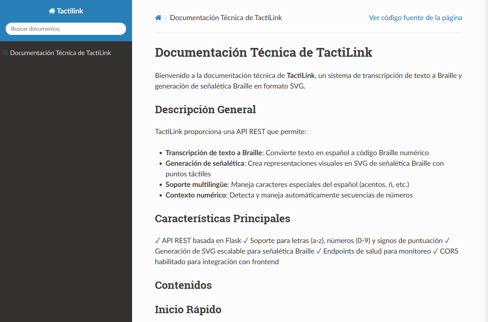
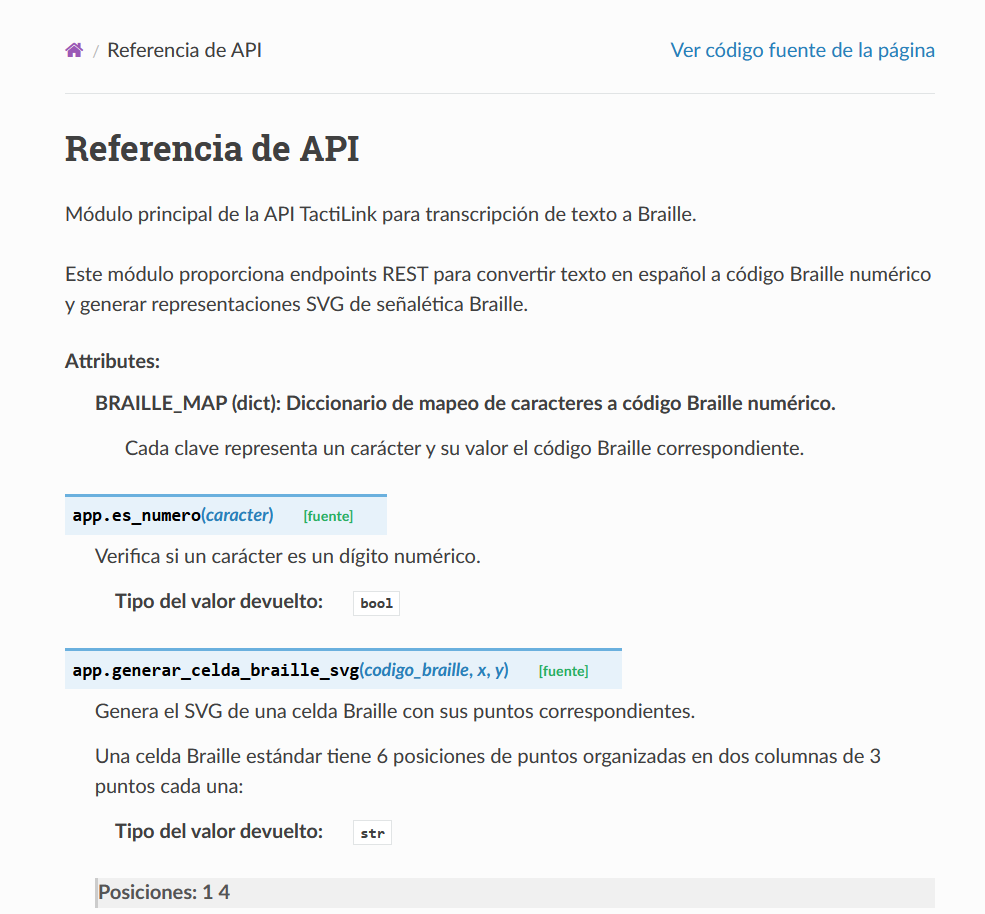
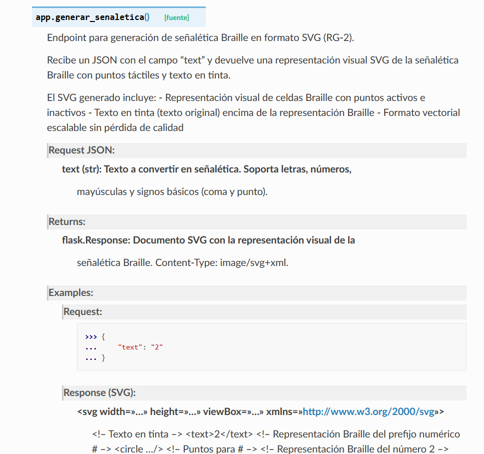
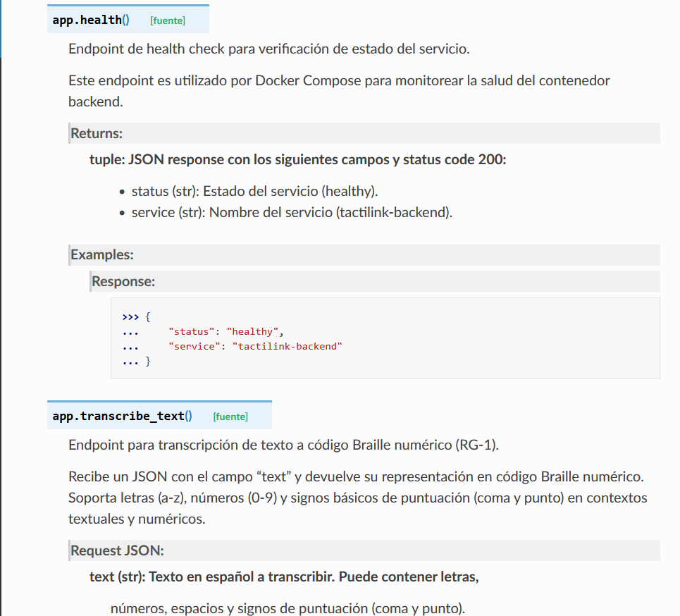

# Acceso a la Documentación Técnica

## ¿Qué es esto?

Esta carpeta contiene la documentación técnica completa de TactiLink. 
Es como un manual que explica:
- Cómo funciona la API
- Qué funciones están disponibles
- Cómo usarlas con ejemplos

## Ubicación

La documentación técnica está en formato **HTML interactivo** (como un sitio web):

```
DocumentacionTecnica/html/index.html
```

## Cómo Acceder - 3 pasos simples

### Paso 1: Navega a la carpeta
Abre la carpeta `DocumentacionTecnica/html/`

### Paso 2: Abre el archivo
Haz clic en el archivo `index.html` 

### Paso 3: Mira la documentación
Se abrirá en tu navegador web (Chrome, Firefox, Edge, etc.)

## ¿Qué encontrarás adentro?

La documentación incluye:

### 📖 Referencia de API
Una lista completa de todas las funciones con:
- Descripción de qué hace cada una
- Parámetros que necesita
- Resultados que devuelve

## Pantallas de Referencia

### Portada Principal


### Referencia de API






---

### 💡 Ejemplos de uso
Comandos listos para copiar y pegar en tu terminal:
```bash
curl -X POST http://localhost:5000/api/transcribe
```

### 🔍 Búsqueda integrada
Busca cualquier palabra técnica directamente en la documentación

### 📑 Navegación fácil
Menú lateral que te ayuda a moverte entre secciones

## Características especiales

✅ **Búsqueda inteligente**: Busca en español y encuentra resultados relevantes  
✅ **Código resaltado**: El código Python se ve con colores para fácil lectura  
✅ **Responsive**: Funciona en cualquier tamaño de pantalla  
✅ **Offline**: Funciona sin conexión a internet  
✅ **Accesible**: Optimizado para lectores de pantalla

## Nota importante

Esta documentación se genera **automáticamente** a partir del código Python.
Si el código cambia, la documentación se puede regenerar fácilmente usando Sphinx.

---

**Última actualización:** 20 de enero de 2026  
**Formato:** HTML generado por Sphinx  
**Idioma:** Español